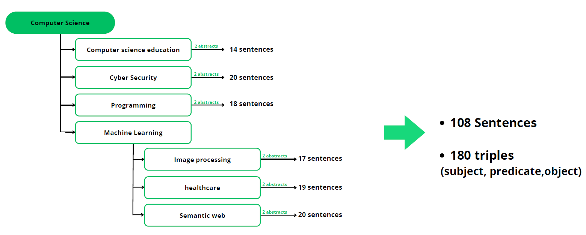

# Computer science Benchmark

This gold standard comprises triplets (subject, predicate, object) extracted from a
computer science corpus (abstracts).

We selected 12 abstracts from computer science articles, totaling 108 sentences.
The abstracts were chosen based on their content (topic), considering the significant
role that topics play in influencing the nature of terms and writing style (such as the
use of technical terms, references, etc.). To achieve this, we carefully choose two
abstracts for each topic, and the details of these abstracts are described in Figure 1.

The gold standard is provided as an excel file. Its columns are:
- subject: The subject of the extracted triplet
- predicate: The predicate of the extracted triplet
- object: The object of the extracted triplet
- sentence: The sentence from which the triplet is extracted
- document_id: The ID of the abstract that the triplet is extracted from
- topic: The topic of the abstract
- annotator 1: annotations from expert 1
- annotator 2: annotations from expert 2
- annotator 3: annotations from expert 3
- triplet_id : triplet id
